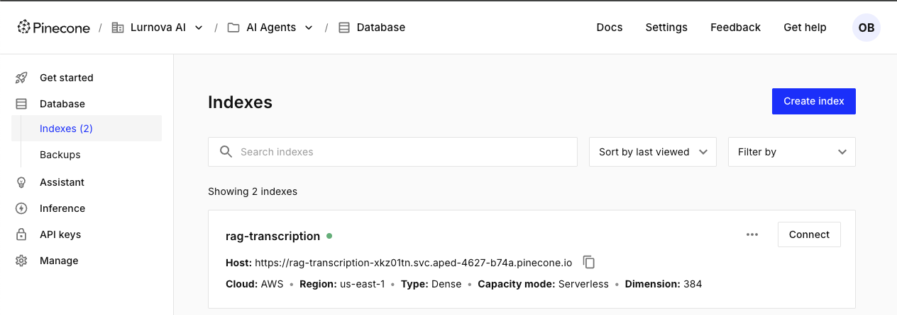

---
jupyter:
  jupytext:
    text_representation:
      extension: .md
      format_name: markdown
      format_version: '1.3'
      jupytext_version: 1.16.7
  kernelspec:
    display_name: Python 3 (ipykernel)
    language: python
    name: python3
---

# RAG

A continuación se muestra una descripción general de alto nivel del sistema que queremos construir:


# PARTE I


Empecemos cargando las variables de entorno que necesitamos utilizar.


## Setting up the model
Definamos el modelo LLM que utilizaremos como parte del flujo de trabajo.

```python
import os
from dotenv import load_dotenv

load_dotenv()

OPENAI_API_KEY = os.getenv("OPENAI_API_KEY")

# Este es el video de YouTube que vamos a utilizar.
YOUTUBE_VIDEO = "https://www.youtube.com/watch?v=aL-EmKuB078&t=2s"
```

```python
from langchain_openai.chat_models import ChatOpenAI

model = ChatOpenAI(openai_api_key=OPENAI_API_KEY, model="gpt-3.5-turbo")
```

Probamos el modelo haciendo una pregunta sencilla

```python
pregunta_sencilla = "¿Cuál es la capital de Túnez?"
respuesta = model.invoke(pregunta_sencilla)

# Imprimimos el contenido de la respuesta
print(respuesta.content)
```

El resultado del modelo es una instancia de `AIMessage` que contiene la respuesta. Podemos extraer esta respuesta encadenando el modelo con un analizador de salida [outputParser](https://python.langchain.com/docs/modules/model_io/output_parsers/).

Así es como se ve el encadenamiento del modelo con un analizador de salida:


Para este ejemplo, utilizaremos un `StrOutputParser` simple para extraer la respuesta como una cadena.

```python
from langchain_core.output_parsers import StrOutputParser

#(convertir AIMessage a string)
parser = StrOutputParser()

# Creamos la cadena simple combinando el modelo y el parser
chain = model | parser

# Probamos la cadena con la misma pregunta sencilla
pregunta_sencilla = "¿Cuál es la capital de Alemaña?"
respuesta_parseada = chain.invoke(pregunta_sencilla)

# Imprimimos la respuesta (ahora debería ser una cadena directamente)
print(respuesta_parseada)
print(type(respuesta_parseada)) # Para verificar que es un string
```

## Presentamos las plantillas de preguntas

Queremos contextualizar el modelo y la pregunta. [Prompt templates](https://python.langchain.com/docs/modules/model_io/prompts/quick_start) Son una forma sencilla de definir y reutilizar indicaciones.

```python
from langchain.prompts import ChatPromptTemplate

template = """
Responda la pregunta según el contexto descrito a continuación. Si no puede responder, responda "No lo sé".

Contexto: {contexto}

Pregunta: {pregunta}
"""

```

Ahora podemos encadenar el mensaje con el modelo y el analizador de salida.


```python
from langchain_core.runnables import  RunnablePassthrough

chain = (
         {
            "contexto": RunnablePassthrough(),
            "pregunta": RunnablePassthrough()
        }
        | ChatPromptTemplate.from_template(template)
        | model
        | parser
    )
```

## Combinación de cadenas

Podemos combinar diferentes cadenas para crear flujos de trabajo más complejos. Por ejemplo, creemos una segunda cadena que traduzca la respuesta de la primera a otro idioma.

Comencemos creando una nueva plantilla de solicitud para la cadena de traducción:

```python
translation_prompt = ChatPromptTemplate.from_template(
    "Traduce {answer} al {language}"
)
```

Ahora podemos crear una nueva cadena de traducción que combine el resultado de la primera cadena con la solicitud de traducción.

Así es como se ve el nuevo flujo de trabajo:


```python
from operator import itemgetter

# Cadena de respuesta usando contexto (primera cadena, ya definida anteriormente)
qa_chain = (
    {
        "contexto": RunnablePassthrough(),
        "pregunta": RunnablePassthrough()
    }
    | ChatPromptTemplate.from_template(template)
    | model
    | parser
)

# Crear la cadena de traducción
translation_chain = (
    {
        "answer": RunnablePassthrough(),
        "language": lambda _: "Inglés"  # valor predeterminado
    }
    | translation_prompt
    | model
    | parser
)

# Combinamos ambas cadenas: primero obtenemos la respuesta, luego la traducimos
combined_chain = qa_chain | (lambda answer: translation_chain.invoke({"answer": answer, "language": "Castellano"}))

# Probemos la cadena combinada
respuesta_traducida = combined_chain.invoke({
    "contexto": "París es la capital de Francia y una de las ciudades más visitadas del mundo.",
    "pregunta": "¿Cuál es la capital de Francia?"
})

print("Respuesta traducida:", respuesta_traducida)
```

# PARTE II


## Transcripcion de video de YouTube

El contexto que queremos enviar al modelo proviene de un video de YouTube. Descargamos el video y transcribámoslo con [OpenAI's Whisper](https://openai.com/research/whisper).

```python
import tempfile
import whisper
import os
import yt_dlp  # Using yt-dlp instead of pytube

if not os.path.exists("transcription.txt"):
    print(f"Descargando video: {YOUTUBE_VIDEO}")
    
    # Create a temporary directory for the download
    with tempfile.TemporaryDirectory() as tmpdir:
        # yt-dlp options for downloading audio only
        ydl_opts = {
            'format': 'bestaudio/best',
            'outtmpl': os.path.join(tmpdir, 'audio.%(ext)s'),
            'postprocessors': [{
                'key': 'FFmpegExtractAudio',
                'preferredcodec': 'mp3',
                'preferredquality': '192',
            }],
            'quiet': False
        }
        
        # Download the audio
        with yt_dlp.YoutubeDL(ydl_opts) as ydl:
            ydl.extract_info(YOUTUBE_VIDEO, download=True)
            audio_file = os.path.join(tmpdir, 'audio.mp3')
        
        print(f"Transcribiendo archivo de audio: {audio_file}")
        
        # Load Whisper model
        whisper_model = whisper.load_model("base")
        
        # Transcribir el audio
        transcription = whisper_model.transcribe(audio_file, fp16=False)["text"].strip()
        
        # Save the transcription to a file
        with open("transcription.txt", "w") as file:
            file.write(transcription)
        
        print("Transcription completed and saved to 'transcription.txt'")
else:
    print("Transcription file already exists!")
```

Vamos a leer la transcripción y mostrar los primeros caracteres para asegurarnos de que todo funciona como se espera.

```python
with open("transcription.txt") as file:
    transcription = file.read()

transcription[:100]
```

## Usando la transcripción completa como contexto

Si intentamos invocar la cadena usando la transcripción como contexto, el modelo devolverá un error porque el contexto es demasiado largo.

Los modelos de lenguaje grandes admiten tamaños de contexto limitados. El vídeo que estamos usando es demasiado largo para que el modelo lo pueda procesar, por lo que necesitamos buscar una solución diferente.

```python
# Primero, aseguramos que tengamos la transcripción cargada
with open("transcription.txt") as file:
    transcription = file.read()

# Ahora intentamos usar la transcripción como contexto
try:
    chain.invoke({
        "context": transcription,
        "question": "¿Es una buena idea leer artículos?"
    })
except Exception as e:
    print(e)
```

## División de la transcripción

Dado que no podemos usar la transcripción completa como contexto para el modelo, una posible solución es dividir la transcripción en fragmentos más pequeños. Así, podemos invocar el modelo utilizando solo los fragmentos relevantes para responder a una pregunta específica:


Comencemos cargando la transcripción en la memoria:

```python
from langchain_community.document_loaders import TextLoader

# Load the transcription file
loader = TextLoader("transcription.txt")
documents = loader.load()

# Print basic info about the loaded document
print(f"Loaded {len(documents)} document")
print(f"Text length: {len(documents[0].page_content)} characters")


```

Hay muchas maneras de dividir un documento. En este ejemplo, usaremos un divisor simple que divide el documento en fragmentos de tamaño fijo. Consulta [Divisores de texto](https://python.langchain.com/docs/modules/data_connection/document_transformers/) para obtener más información sobre los diferentes enfoques para dividir documentos.

A modo de ejemplo, dividiremos la transcripción en fragmentos de 100 caracteres con una superposición de 20 caracteres y mostraremos los primeros fragmentos:

```python
from langchain_community.document_loaders import TextLoader
from langchain.text_splitter import RecursiveCharacterTextSplitter

# First load the document
loader = TextLoader("transcription.txt")
documents = loader.load()

# Create a text splitter with chunk size of 100 and overlap of 20 characters
text_splitter = RecursiveCharacterTextSplitter(
    chunk_size=100,
    chunk_overlap=20,
    length_function=len,
)

# Split the document into chunks
chunks = text_splitter.split_documents(documents)

# Display information about the chunks
print(f"Split the document into {len(chunks)} chunks")

# Show the first 3 chunks as an example
print("\nFirst three chunks:")
for i, chunk in enumerate(chunks[:3]):
    print(f"\nChunk {i+1}:")
    print(f"Length: {len(chunk.page_content)} characters")
    print(f"Content: {chunk.page_content}")
```

Para nuestra aplicación específica, utilizaremos 1000 caracteres en su lugar:

```python
from langchain.text_splitter import RecursiveCharacterTextSplitter

# Create a text splitter with chunk size of 1000 and overlap of 200 characters
text_splitter = RecursiveCharacterTextSplitter(
    chunk_size=1000,
    chunk_overlap=200,
    length_function=len,
)

# Split the document into chunks
chunks = text_splitter.split_documents(documents)

# Display information about the chunks
print(f"Split the document into {len(chunks)} chunks")

# Show the first chunk as an example
if chunks:
    print("\nFirst chunk:")
    print(f"Length: {len(chunks[0].page_content)} characters")
    print(f"Content: {chunks[0].page_content}")
```

# PARTE III

<!-- #region -->
## Configuración de un Vector Store

Necesitamos una forma eficiente de almacenar fragmentos de documentos, sus Embeddings y realizar búsquedas de similitud a gran escala. Para ello, usaremos un Vector Store.

Un Vector Store es una base de datos de Embeddings especializada en búsquedas rápidas de similitud.


Necesitamos configurar un retriever (https://python.langchain.com/docs/how_to/#retrievers). Este retriever realizará una búsqueda de similitud en el almacén vectorial y devolverá los documentos más similares al siguiente paso de la cadena.
<!-- #endregion -->

## Configurar Pinecone

Para este ejemplo, usaremos [Pinecone](https://www.pinecone.io/).



El primer paso es crear una cuenta de Pinecone, configurar un índice, obtener una clave API y configurarla como variable de entorno `PINECONE_API_KEY`.

```python
from langchain_pinecone import PineconeVectorStore
from langchain_community.embeddings import HuggingFaceEmbeddings
import os
from pinecone import Pinecone, ServerlessSpec

# Initialize Pinecone
PINECONE_API_KEY = os.getenv("PINECONE_API_KEY")

# Create Pinecone client
pc = Pinecone(api_key=PINECONE_API_KEY)

# Create the index name 
index_name = "rag-transcription"

# Si el índice existe, lo eliminamos primero para recrearlo con la dimensión correcta
if index_name in pc.list_indexes().names():
    print(f"Eliminating existing index '{index_name}' to recreate with correct dimensions")
    pc.delete_index(index_name)
    # Esperar un momento para que la eliminación se complete
    import time
    time.sleep(5)

# Create the index with the correct dimensions
pc.create_index(
    name=index_name,
    dimension=384,  # HuggingFace 'all-MiniLM-L6-v2' embeddings have 384 dimensions
    metric="cosine",
    spec=ServerlessSpec(
        cloud="aws",
        region="us-east-1"
    )
)
print(f"Created new index '{index_name}' with dimension 384")

# Initialize HuggingFace embeddings model (no API key needed, runs locally)
embeddings = HuggingFaceEmbeddings(model_name="all-MiniLM-L6-v2")

# Create the vector store and load the documents
vectorstore = PineconeVectorStore.from_documents(
    documents=chunks,  # Use your previously created chunks
    embedding=embeddings,
    index_name=index_name
)

print(f"Successfully loaded {len(chunks)} chunks into Pinecone index '{index_name}'")
```

Ahora ejecutemos una búsqueda de similitud en pinecone para asegurarnos de que todo funciona:

```python
# Test similarity search
query = "What are the main topics discussed in the video?"
docs = vectorstore.similarity_search(query, k=3)

print("\nResults for query:", query)
print("-" * 50)
for i, doc in enumerate(docs, 1):
    print(f"\nResult {i}:")
    print(doc.page_content)
    print("-" * 50)
```

Configuremos la nueva cadena usando Pinecone como almacén vectorial:

```python
from langchain_pinecone import PineconeVectorStore
from langchain_core.runnables import RunnableParallel, RunnablePassthrough
from langchain_openai import ChatOpenAI
from langchain_core.prompts import ChatPromptTemplate
from langchain_core.output_parsers import StrOutputParser

# Create the prompt template
template = """Answer the following question based on the provided context:

Context:
{context}

Question:
{question}

Answer the question based on the context provided. If you cannot find the answer in the context, say so."""

prompt = ChatPromptTemplate.from_template(template)

# Create the RAG chain
model = ChatOpenAI(temperature=0, model="gpt-3.5-turbo")

# Create the chain components
chain = (
    RunnableParallel(
        context=lambda x: vectorstore.similarity_search(x["question"], k=3),
        question=RunnablePassthrough()
    )
    | prompt
    | model
    | StrOutputParser()
)

# Test the chain
question = "What are the key points discussed in the video?"
response = chain.invoke({"question": question})
print("\nQuestion:", question)
print("\nAnswer:", response)
```
